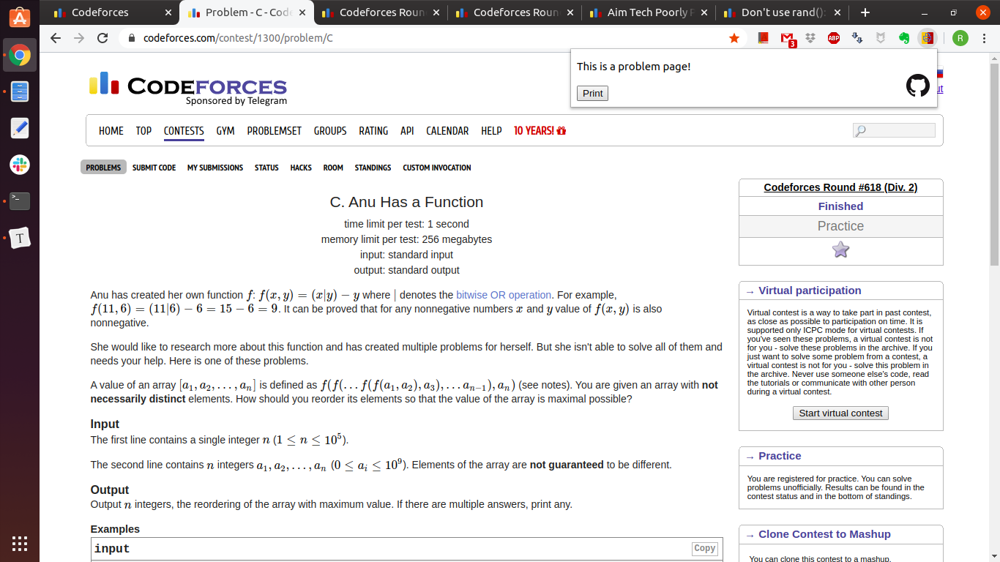
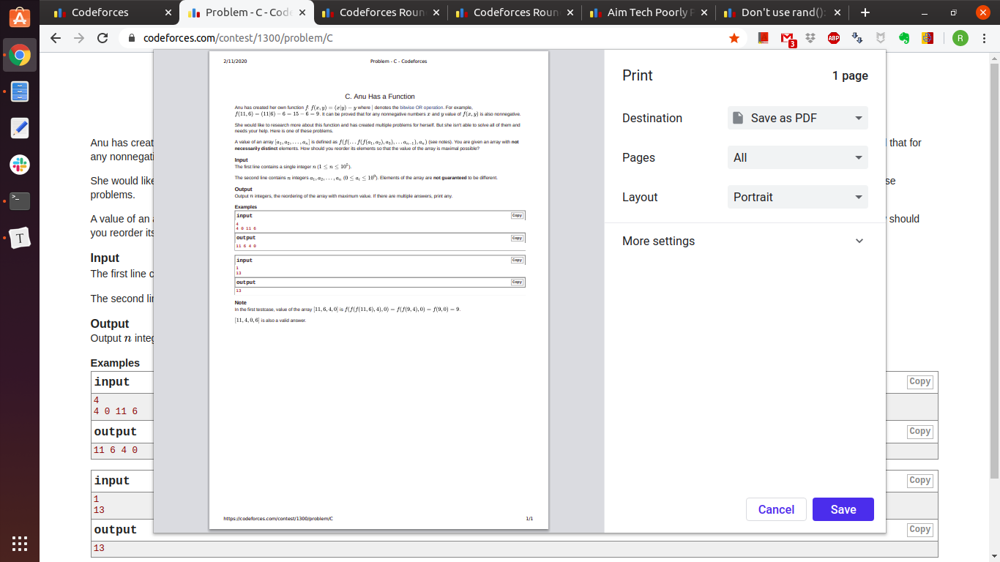
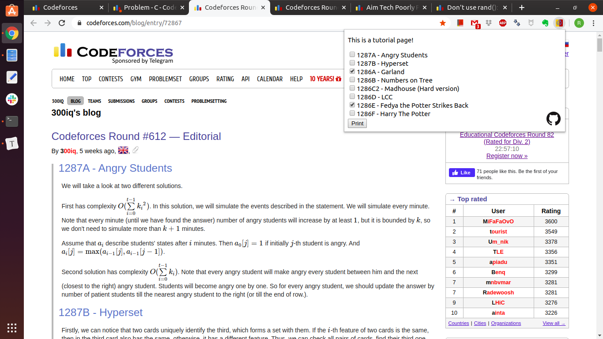
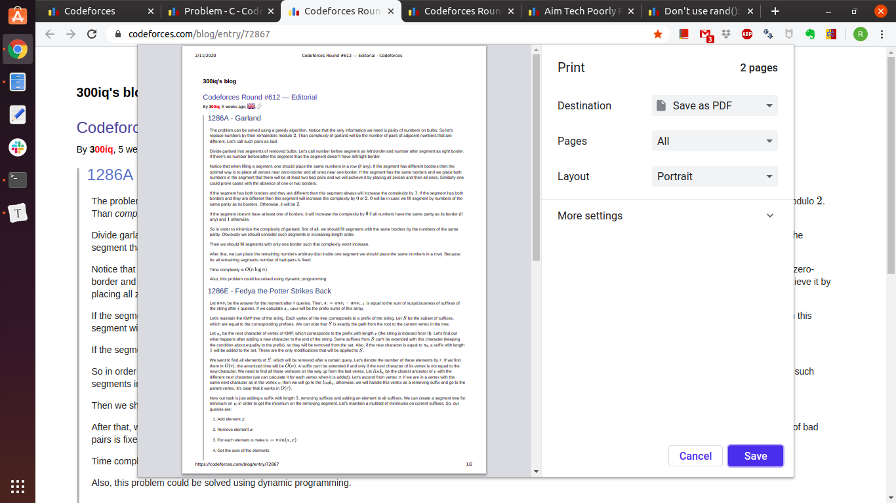
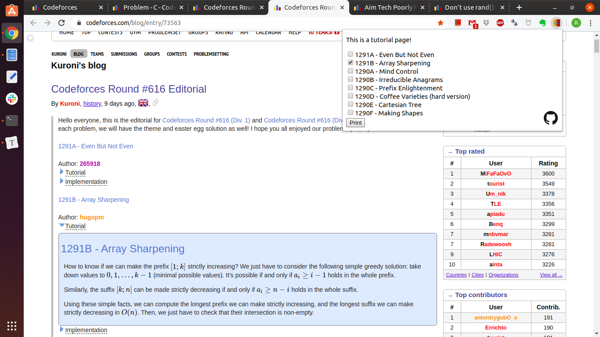
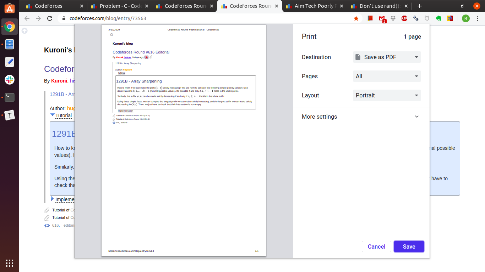
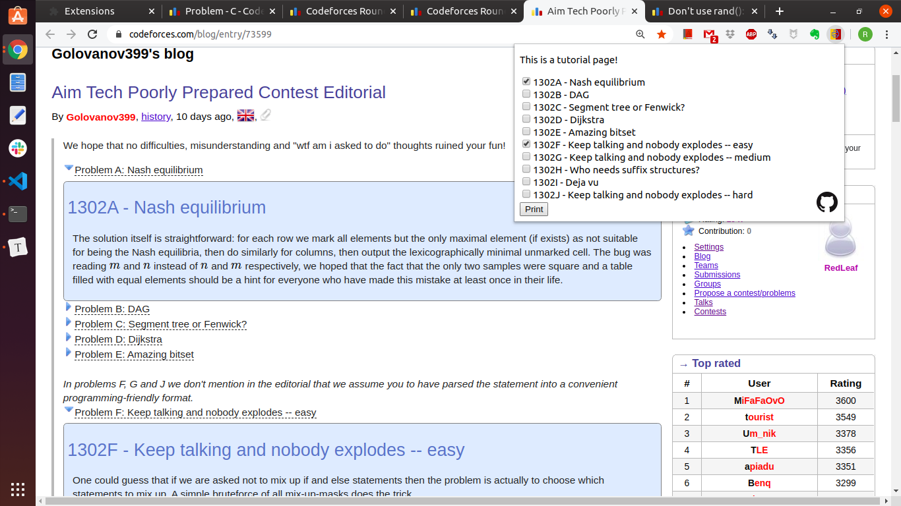
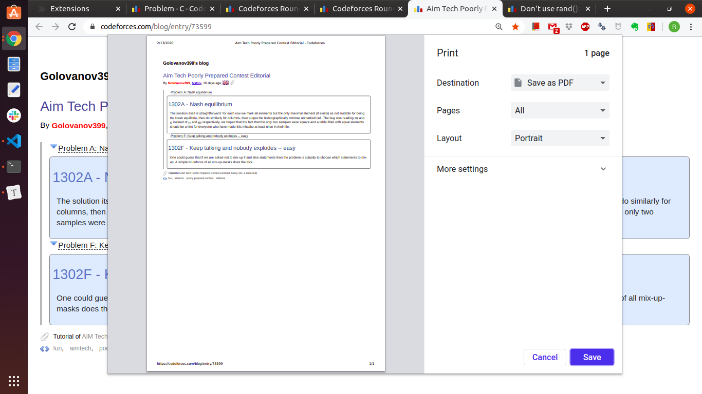
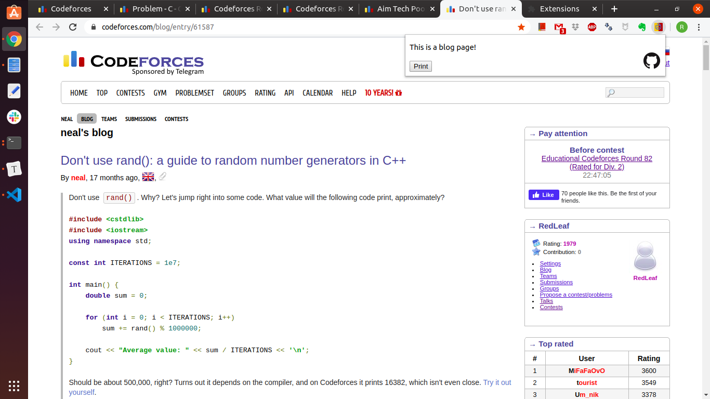
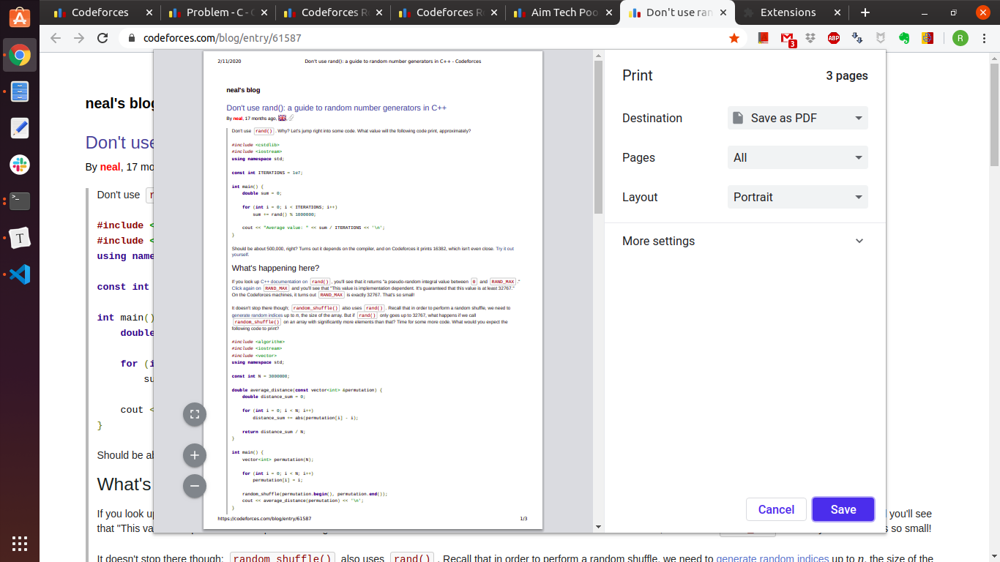

# CF-FriendlyPrint
A chrome extension supporting friendly-print on [codeforces](https://codeforces.com/) problems, tutorials, and even blog entries!

Compatible with most problems, tutorials and blog entries on codeforces.

## Installation

1. Download and extract the extension from the [release page](https://github.com/Redleaf23477/CF-FriendlyPrint/releases/tag/v0.1.0).
2. Go to `chrome://extensions` in chrome (simply type it in the address bar).
3. Turn on developer mode. Then press "Load unpacked" button.
4. Select the extracted folder(name of the folder should be `CF-FriendlyPrint-0.1.0` by default).
5. You've finished installing the extension!

(I found a [blog](https://webkul.com/blog/how-to-install-the-unpacked-extension-in-chrome/) that explains how to install extensions in detail and with pictures. Hope it helps!)

## How to Use

Friendly-print is only supported on codeforces problem set problems (problems in gym are not supported), tutorials (tutorials of regular codeforces rounds only), and blog entries.

### Problem Pages

Simply press the print button after the page is fully loaded.  Then you get the print preview page!

### Tutorial Pages

After the page is fully loaded, you'll see a list of check-boxes.  Check the problems you wish to print and press the print button.  Tada :tada:   You get the print preview page without seeing other problems!

#### Tutorial Pages with Spoiler Buttons

For tutorials that uses spoilers (toggling buttons to show tutorials), simply toggle the problems you wish to print, and then click the extension.  You'll see that those problems are checked automatically!  Finally, you know which button to click :sunglasses:

Furthermore, it turns out to work well with most tutorial pages!

### Blog Pages

Blog pages are also supported!  Simply press the print button to get the print preview page!

### Dummy Mode

The above mentioned are demonstrated under **normal** mode.  In option page of this extension (right click on extension button to find options), you can switch app mode to **dummy** mode.

Dummy mode simply removes header, top menu, side bar, footer, and stuffs that have nothing to do with the content of the problem or blog entry and print the web page afterwards.  Users can use chrome dev-tools (press `<F12>` in chrome) and remove elements they don't wish to see by themselves.

In most pages, normal mode is simply enough.  However, since there isn't unified format on tutorials, normal mode may end up deleting wrong elements in the page or encounter some unexpected errors.  If normal mode failed to fetch correct contents, you can always use dummy mode and delete the unwanted elements on you own.

## FAQ

**Q: Why am I getting `Loading... Reopen the extension when the webpage is fully loaded...` in the popup?**

A: The extension will start functioning after the web page is fully loaded (including loading tutorials), before that the message will be shown in the extension pop-up.  Simply dismissing the pop-up then reopening the extension after the page is loaded will solve the problem.

**Q: The extension acts weird occasionally in tutorial pages?**

A: The function of printing tutorial is still experimental.  Since there isn't an unified format on tutorials and blog entries, it is challenging to come up with an algorithm to fetch selected problems from the web page.  

In this case, it is suggested to use dummy mode and deleted unwanted DOM elements by yourselves using something like chrome devTools (press `<F12>` in chrome to see it).

## Contact

If you have any question about the extension, feel free to contact me through email.  Feedbacks, comments, suggestions are very welcome!

Author: @redleaf23477

email: schpokeool@gmail.com