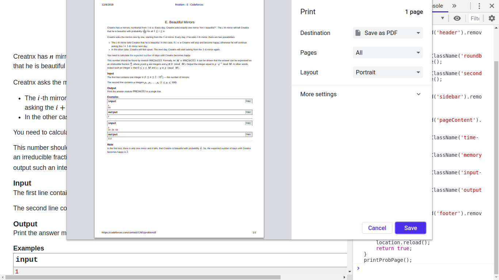
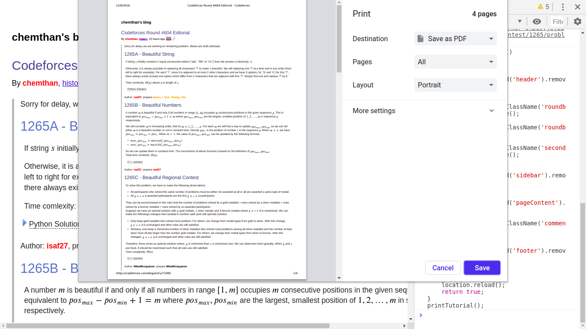

# CF-FriendlyPrint
Friendly Print for codeforces problem and tutorial.

Some javascripts to print codeforces problems and tutorials without sidebar, top menu, ... etc.

Hope to pack it to chrome extension.

## How to Use

- Copy the javascript to clipboard
- Go the the problem / tutorial webpage, and paste the javascript to the console and press enter
  - For chrome users, press `F12` key to open console

## Screenshots

Printing a [problem](https://codeforces.com/contest/1265/problem/E) using [printProb.js](https://github.com/Redleaf23477/CF-FriendlyPrint/blob/master/printProb.js)

Printing a [tutorial page](https://codeforces.com/blog/entry/71995) using [printTutorial.js](https://github.com/Redleaf23477/CF-FriendlyPrint/blob/master/printTutorial.js)

## Issues to be solved

Codeforces tutorials does not have an uniformed format, making it difficult to select which problems (which `
` tags) to print.  For example, it isn't simple to select `
` only some problems (instead of all problems) to print in this [tutorial](https://codeforces.com/blog/entry/71995), and [another tutorial](https://codeforces.com/blog/entry/71844) has very different format.
